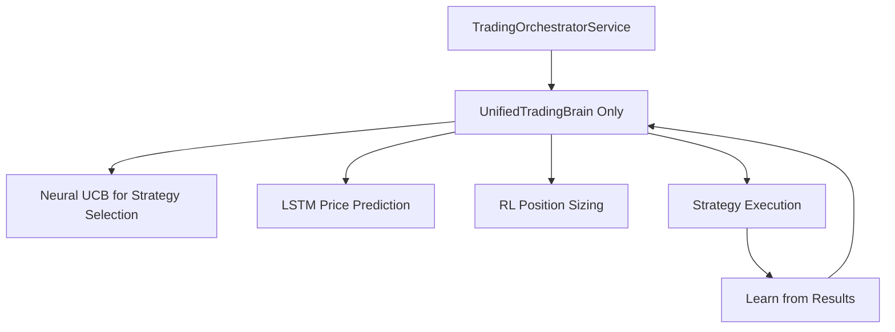
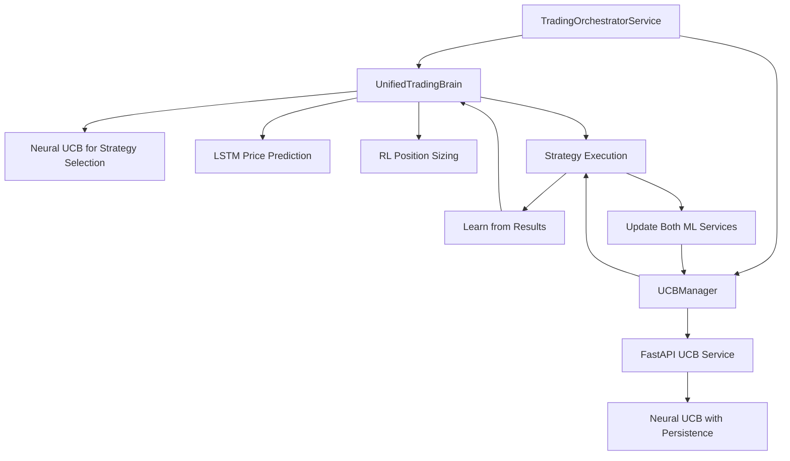

# 🔄 **BEFORE vs AFTER - UCB Integration Evolution**

## **📊 SYSTEM ARCHITECTURE COMPARISON**

### **🔴 BEFORE (Single ML Brain):**



### **🟢 AFTER (Dual ML System):**



---

## **🏗️ DEPENDENCY INJECTION CHANGES**

### **🔴 BEFORE - Program.cs (Missing ML Registration):**
```csharp
// ❌ NO ML SERVICES REGISTERED
services.AddSingleton<TopstepAuthAgent>();
services.AddSingleton<ITradingOrchestrator, TradingOrchestratorService>();
// UnifiedTradingBrain and UCB were NOT in DI container!
```

### **🟢 AFTER - Program.cs (Full ML Stack):**
```csharp
// ✅ COMPLETE ML BRAIN REGISTRATION
services.AddSingleton<TopstepAuthAgent>();

// AI/ML Trading Brain Registration - DUAL ML APPROACH
services.AddSingleton<UnifiedTradingBrain>();
Console.WriteLine("🧠 Unified Trading Brain registered - Core AI intelligence enabled");

// UCB Manager (optional) - Auto-detect if UCB service is available
var enableUcb = Environment.GetEnvironmentVariable("ENABLE_UCB") != "0"; // Default to enabled
if (enableUcb)
{
    services.AddSingleton<UCBManager>();
    Console.WriteLine($"🎯 UCB Manager registered - UCB service at {ucbUrl}");
}

services.AddSingleton<ITradingOrchestrator, TradingOrchestratorService>();
```

---

## **🧠 TRADING ORCHESTRATOR CHANGES**

### **🔴 BEFORE - Constructor (Single Brain):**
```csharp
public TradingOrchestratorService(
    ILogger<TradingOrchestratorService> logger,
    HttpClient httpClient,
    TopstepAuthAgent authAgent,
    ICentralMessageBus messageBus,
    UnifiedTradingBrain tradingBrain) // Only brain, no UCB
{
    _logger = logger;
    _httpClient = httpClient;
    _authAgent = authAgent;
    _messageBus = messageBus;
    _tradingBrain = tradingBrain; // Only one ML service
    
    // No UCB manager
}
```

### **🟢 AFTER - Constructor (Dual ML):**
```csharp
public TradingOrchestratorService(
    ILogger<TradingOrchestratorService> logger,
    HttpClient httpClient,
    TopstepAuthAgent authAgent,
    ICentralMessageBus messageBus,
    UnifiedTradingBrain tradingBrain,
    UCBManager? ucbManager = null) // ✅ Optional UCB service
{
    _logger = logger;
    _httpClient = httpClient;
    _authAgent = authAgent;
    _messageBus = messageBus;
    _tradingBrain = tradingBrain; // Existing sophisticated brain
    _ucbManager = ucbManager;      // ✅ NEW: UCB service
    
    var ucbStatus = _ucbManager != null ? "with UCB service" : "without UCB service";
    _logger.LogInformation("🧠 [ORCHESTRATOR] Unified Trading Brain integrated {UcbStatus}", ucbStatus);
}
```

---

## **⚡ TRADING EXECUTION FLOW CHANGES**

### **🔴 BEFORE - Single Learning Loop:**
```csharp
// ProcessAITradingSignalAsync - OLD VERSION
private async Task ProcessAITradingSignalAsync(TradingSignal signal, BrainDecision brainDecision, 
    WorkflowExecutionContext context, CancellationToken cancellationToken)
{
    // Execute trade
    var executionResult = await ExecuteSignalAsync(signal, cancellationToken);
    
    // Update ONLY the brain
    await _tradingBrain.LearnFromResultAsync(
        signal.Symbol, 
        signal.Reasoning, 
        executionResult.PnL, 
        executionResult.Success, 
        TimeSpan.Zero, 
        cancellationToken);
        
    // Update brain P&L tracking
    if (executionResult.Success && executionResult.PnL != 0m)
    {
        _tradingBrain.UpdatePnL(signal.Reasoning, executionResult.PnL);
        // ❌ NO UCB UPDATES
    }
}
```

### **🟢 AFTER - Dual Learning Loop:**
```csharp
// ProcessAITradingSignalAsync - NEW VERSION
private async Task ProcessAITradingSignalAsync(TradingSignal signal, BrainDecision brainDecision, 
    WorkflowExecutionContext context, CancellationToken cancellationToken)
{
    // Execute trade
    var executionResult = await ExecuteSignalAsync(signal, cancellationToken);
    
    // Update brain (existing logic)
    await _tradingBrain.LearnFromResultAsync(
        signal.Symbol, 
        signal.Reasoning, 
        executionResult.PnL, 
        executionResult.Success, 
        TimeSpan.Zero, 
        cancellationToken);

    // Update BOTH brain and UCB P&L tracking
    if (executionResult.Success && executionResult.PnL != 0m)
    {
        // Update brain (existing)
        _tradingBrain.UpdatePnL(signal.Reasoning, executionResult.PnL);
        
        // ✅ NEW: Also update UCB service if available
        if (_ucbManager != null)
        {
            try
            {
                await _ucbManager.UpdatePnLAsync(signal.Reasoning, executionResult.PnL);
                _logger.LogInformation("🎯 [UCB-PNL] Updated strategy {Strategy} with P&L: {PnL:C}", 
                    signal.Reasoning, executionResult.PnL);
            }
            catch (Exception ex)
            {
                _logger.LogWarning(ex, "⚠️ [UCB] Failed to update P&L - continuing");
            }
        }
    }
}
```

---

## **🌅 DAILY RESET CHANGES**

### **🔴 BEFORE - Single Service Reset:**
```csharp
public async Task StartTradingDayAsync(CancellationToken cancellationToken = default)
{
    // Reset only the brain
    _tradingBrain.ResetDailyStats();
    _logger.LogInformation("🌅 [BRAIN] Daily stats reset");
    
    // ❌ NO UCB RESET
}
```

### **🟢 AFTER - Dual Service Reset:**
```csharp
public async Task StartTradingDayAsync(CancellationToken cancellationToken = default)
{
    // Reset brain (existing)
    _tradingBrain.ResetDailyStats();
    _logger.LogInformation("🌅 [BRAIN] Daily stats reset");
    
    // ✅ NEW: Also reset UCB if available
    if (_ucbManager != null)
    {
        try
        {
            await _ucbManager.ResetDailyAsync(cancellationToken);
            _logger.LogInformation("🌅 [UCB] Daily stats reset");
        }
        catch (Exception ex)
        {
            _logger.LogWarning(ex, "⚠️ [UCB] Failed to reset daily stats");
        }
    }
}
```

---

## **📁 NEW FILES ADDED**

### **🆕 UCB Stack Files (Didn't Exist Before):**
```
src/BotCore/ML/
└── UCBManager.cs                ✅ NEW - C# client for UCB service

python/ucb/
├── neural_ucb_topstep.py       ✅ NEW - Enhanced UCB model  
├── ucb_api.py                  ✅ NEW - FastAPI server
├── train_neural_ucb.py         ✅ NEW - Training script
├── start_ucb_server.py         ✅ NEW - Server startup
├── smoke_test_ucb.py           ✅ NEW - API tests
└── requirements.txt            ✅ NEW - Dependencies
```

---

## **🎯 KEY DIFFERENCES SUMMARY**

| **Aspect** | **🔴 BEFORE** | **🟢 AFTER** |
|------------|---------------|---------------|
| **ML Services** | 1 (UnifiedTradingBrain only) | 2 (Brain + UCBManager) |
| **DI Registration** | ❌ ML services not registered | ✅ Both services auto-registered |
| **Learning Loop** | Single brain updates | Dual updates (brain + UCB) |
| **Daily Reset** | Brain only | Both brain and UCB |
| **Fallback** | Brain fails = no ML | UCB fails = brain continues |
| **P&L Tracking** | Brain only | Both services track P&L |
| **Configuration** | Hardcoded | Environment variables |
| **API Stack** | C# only | C# + Python FastAPI |
| **Persistence** | Memory only | Pickle persistence |
| **Architecture** | Monolithic ML | Microservice ML |

---

## **🚀 EVOLUTION BENEFITS**

### **🔴 BEFORE Limitations:**
- ❌ Single point of ML failure
- ❌ No service persistence across restarts
- ❌ Hardcoded configurations
- ❌ Limited learning approaches
- ❌ No production timeout handling

### **🟢 AFTER Advantages:**
- ✅ **Dual ML resilience** - If UCB fails, brain continues
- ✅ **Gradual migration** - Can test UCB alongside existing brain
- ✅ **Production timeouts** - 5s HTTP timeout with graceful fallback
- ✅ **Persistence** - UCB state survives restarts with pickle
- ✅ **NaN protection** - Comprehensive guards against invalid correlations
- ✅ **Auto-configuration** - Environment variable based setup
- ✅ **Microservice architecture** - Python ML service + C# orchestrator
- ✅ **Enhanced learning** - Both services learn from the same trades

**Status: 🟢 EVOLUTION COMPLETE** - From single ML brain to resilient dual ML system!
