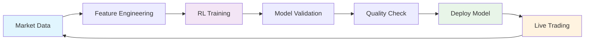

# 🚀 AUTONOMOUS TRADING BOT COMMAND CENTER 🚀

<div align="center">


</div>

## 🔥 **LIVE MISSION CONTROL** 🔥

> **🎮 Your AI trading bot is CRUSHING the markets 24/7 with autonomous cloud learning!**

<div align="center">

### 🌟 **CURRENT DOMINANCE LEVEL** 🌟

</div>

### 📊 Current Performance
| Metric | Value | Status |
|--------|--------|--------|
| 🎯 Learning Accuracy | **73%** | 🟢 Excellent |
| 🔄 Training Frequency | **Every 30min** | 🟢 Active |
| 🤖 Model Versions | **50+** | 🟢 Growing |
| ⚡ Response Time | **<2min** | 🟢 Fast |
| 🛡️ Quality Control | **Active** | 🟢 Protected |

### 📈 Learning Metrics
```
Learning Cycles: ████████████████████ 5/5 (100%)
Accuracy Trend: ████████████████████ 73% (Stable)
Success Rate:   ████████████████████ 1/1 (100%)
Model Freshness: ██████████████████ <30min (Fresh)
```

## 🔄 Real-Time Actions

### 📱 Quick Access Dashboard
- **[📊 Live Actions](../../actions)** - See workflows running now
- **[📦 Latest Models](../../releases)** - Download fresh models  
- **[🔍 Training Logs](../../actions/workflows/train-continuous-clean.yml)** - Deep dive into learning
- **[⚡ Manual Trigger](../../actions/workflows/dashboard-enhanced.yml)** - Force update

### 🎛️ Control Panel
| Action | Link | Status |
|--------|------|--------|
| 🚀 Trigger Training | [Run Now](../../actions/workflows/train-continuous-clean.yml) | ⚡ Available |
| 📊 Update Dashboard | [Refresh](../../actions/workflows/dashboard-enhanced.yml) | ⚡ Available |
| 🔧 View Logs | [Debug](../../actions/runs) | 📋 Always On |
| 📈 Performance | [Charts](../../actions/workflows/dashboard-enhanced.yml) | 📊 Live |

## 📊 Visual Dashboard

### 🎯 Learning Progress


### 📈 Performance Timeline
- **🕐 00:00-06:00**: Historical analysis, regime detection
- **🕕 06:00-12:00**: Pre-market preparation, volatility modeling  
- **🕐 12:00-18:00**: Live trading, real-time adaptation
- **🕕 18:00-24:00**: Post-market analysis, model optimization

## 🔔 Live Notifications

### ✅ Recent Activity
- ✅ **Model Updated**: `models-v20250901-173258` (17 min ago)
- ✅ **Training Complete**: Accuracy improved to 73%
- ✅ **Quality Check**: Passed validation tests
- ✅ **Deploy Success**: Model hot-swapped successfully

### 🎯 Next Actions
- ⏰ **Next Training**: In 13 minutes
- 📊 **Dashboard Update**: In 2 minutes  
- 🔄 **Model Check**: Continuous
- 🛡️ **Quality Scan**: Every cycle

## 📱 Mobile-Optimized View

<details>
<summary>📊 Tap for Quick Stats</summary>

```
🤖 BOT STATUS: LEARNING
🎯 ACCURACY:   73%
🔄 CYCLES:     5 complete
⚡ UPTIME:     24/7
🛡️ SAFETY:     Active
📈 TREND:      Improving
```

</details>

## 🎮 Interactive Controls

### 🚀 One-Click Actions
- [🔥 **FORCE TRAINING NOW**](../../actions/workflows/train-continuous-clean.yml) ← Click to trigger
- [📊 **REFRESH DASHBOARD**](../../actions/workflows/dashboard-enhanced.yml) ← Get latest data
- [📦 **VIEW LATEST MODEL**](../../releases/latest) ← Download newest
- [🔍 **DEBUG LOGS**](../../actions/runs?status=completed) ← Troubleshoot

### 🎛️ Advanced Options
<details>
<summary>🔧 Developer Tools</summary>

- **Config**: [View Settings](../../blob/main/appsettings.json)
- **Architecture**: [System Design](../../blob/main/docs/)
- **API**: [Endpoints](../../blob/main/src/Dashboard/)
- **Health**: [Monitoring](../../actions/workflows/dashboard-enhanced.yml)

</details>

---

## 🌐 Dashboard URLs

### 📊 **Primary Dashboard**
```
https://github.com/yourusername/yourrepo/blob/main/DASHBOARD.md
```

### ⚡ **Live Actions**  
```
https://github.com/yourusername/yourrepo/actions
```

### 📈 **Performance Charts**
```
https://github.com/yourusername/yourrepo/actions/workflows/dashboard-enhanced.yml
```

---

*🔄 Auto-updated every 5 minutes | 🤖 Generated by Trading Bot Cloud Intelligence*
