## 🎯 **How Your Bot Trains on Historical Data**

### **The Complete Data Flow**

```mermaid
graph TD
    A[📊 C# Bot Trading] --> B[🎯 Signal Generation]
    B --> C[💾 Log Features + Outcomes]
    C --> D[📁 JSONL Files Daily]
    D --> E[📈 Export CSV Monthly]
    E --> F[🧠 Python RL Training]
    F --> G[🔄 ONNX Model Updated]
    G --> A
```



### **Step 1: Your Bot Collects Data (Already Integrated!)**

✅ **I've added training data collection to your signal generation** in `Program.cs` around line 2757:

```csharp
// When your bot generates a signal, it now also logs RL features
var rlSignalId = $"{symbol}_{chosen.StrategyId}_{DateTime.UtcNow:yyyyMMdd_HHmmss}";
var features = BotCore.RlTrainingDataCollector.CreateFeatureSnapshot(
    rlSignalId, symbol, chosen.StrategyId, chosen.Entry, baselineMultiplier: 1.0m);

features.SignalStrength = chosen.ExpR;  // Your signal score
BotCore.RlTrainingDataCollector.LogFeatures(log, features);
```

**Next: Add trade outcome logging** when trades complete in your position management code.

### **Step 2: Export Training Data**

**Run this monthly to export training data:**

```bash
# From your bot directory
cd "C:\Users\kevin\Downloads\C# ai bot"

# Export last 30 days to CSV
.\src\OrchestratorAgent\bin\Debug\net8.0\OrchestratorAgent.exe --export-rl-data
```

**Or add to your maintenance routine:**

```csharp
// In your scheduled maintenance (monthly)
var csvPath = BotCore.RlTrainingDataCollector.ExportToCsv(log, 
    DateTime.UtcNow.AddDays(-30), DateTime.UtcNow);
log.LogInformation("RL training data exported: {Path}", csvPath);
```

### **Step 3: Train RL Model**

**Once you have 2-4 weeks of data:**

```bash
# Activate Python environment
cd "C:\Users\kevin\Downloads\C# ai bot\ml"
.\rl_env\Scripts\Activate.ps1

# Train on your data
python rl\train_cvar_ppo.py --data "..\data\rl_training\training_data_20250801_20250830.csv" --output_model "..\models\rl\latest_rl_sizer.onnx"
```

### **Step 4: Model Deployment (Automatic)**

✅ **Your `RlSizer` class automatically detects new models:**
- Hot-reloads when `models/rl/latest_rl_sizer.onnx` updates
- Falls back to baseline sizing if model missing
- Applies safety bounds (0.1x-2.0x multiplier)

### **Step 5: Enable RL Sizing**

**Set environment variable to enable:**

```bash
# Enable RL-based position sizing
$env:RL_ENABLED = "1"

# Run your bot
.\launch-bot.ps1
```

---

### **🚀 Your Complete Workflow:**

1. **Day 1-30:** 🤖 C# bot collects features + outcomes automatically
2. **Day 30:** 📊 Export: `--export-rl-data` → CSV file  
3. **Day 30:** 🧠 Train: `python rl\train_cvar_ppo.py` → new ONNX model
4. **Day 31+:** 🚀 C# bot uses improved RL model for position sizing

**Your C# bot stays in C# - Python just processes the data once in a while!** 

The hybrid approach gives you:
- ✅ **Fast C# execution** for live trading
- ✅ **Rich Python ML ecosystem** for training  
- ✅ **Industry-standard ONNX** for model deployment
- ✅ **Hot reloading** without bot restarts
