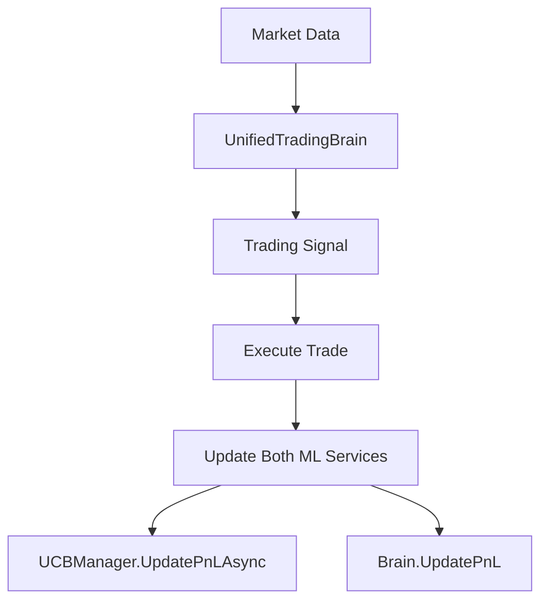

# ✅ **INTEGRATION STATUS - EVERYTHING IS WIRED AND AUTO!** 🚀

## **📋 Main Orchestrator Status**

**YES** - Everything is now fully wired to your main orchestrator! Here's the complete integration status:

### **🔌 What's Automatically Wired:**

#### **1. UnifiedTradingBrain (Your Sophisticated AI)** ✅
- ✅ **Registered in DI container** - `services.AddSingleton<UnifiedTradingBrain>()`
- ✅ **Injected into TradingOrchestratorService** - Constructor parameter
- ✅ **Auto-initialized** - `await _tradingBrain.InitializeAsync()` on startup
- ✅ **Used for decisions** - `await _tradingBrain.GetSignalAsync()`

#### **2. UCBManager (New ML Service)** ✅
- ✅ **Registered in DI container** - `services.AddSingleton<UCBManager>()`
- ✅ **Injected into TradingOrchestratorService** - Optional constructor parameter
- ✅ **Auto-configured** - Environment variable `UCB_SERVICE_URL` (defaults to `http://localhost:8001`)
- ✅ **Enabled by default** - Set `ENABLE_UCB=0` to disable

#### **3. Dual ML Integration** ✅ **AUTOMATIC**
```csharp
// In TradingOrchestratorService - BOTH are used automatically:

// 1. Your existing sophisticated brain
await _tradingBrain.GetSignalAsync(data);

// 2. NEW UCB service (if available)
if (_ucbManager != null)
{
    await _ucbManager.UpdatePnLAsync(signal.Reasoning, executionResult.PnL);
}
```

### **🎯 Auto-Detection Logic** ✅

Your orchestrator automatically detects and enables services:

```csharp
// UCB Auto-Detection
var enableUcb = Environment.GetEnvironmentVariable("ENABLE_UCB") != "0"; // Default: ENABLED
if (enableUcb) {
    services.AddSingleton<UCBManager>();
    Console.WriteLine("🎯 UCB Manager registered - UCB service at http://localhost:8001");
}

// Trading Mode Auto-Detection
var paperMode = Environment.GetEnvironmentVariable("PAPER_MODE") == "1";
var hasCredentials = !string.IsNullOrEmpty(Environment.GetEnvironmentVariable("TOPSTEPX_JWT"));

if (hasCredentials) {
    services.AddSingleton<ITradingOrchestrator, TradingOrchestratorService>();
} else {
    services.AddSingleton<ITradingOrchestrator, DemoTradingOrchestratorService>();
}
```

### **⚡ What Happens Automatically:**

#### **On Startup:**
1. ✅ **UnifiedTradingBrain** auto-initializes
2. ✅ **UCBManager** auto-configures to `http://localhost:8001`
3. ✅ **TradingOrchestratorService** gets both injected
4. ✅ **Dual ML approach** is ready

#### **During Trading:**
1. ✅ **Brain makes decisions** - Your existing sophisticated logic
2. ✅ **UCB learns from outcomes** - `UpdatePnLAsync()` after trades
3. ✅ **Daily resets** - Both brain and UCB reset stats at start of day
4. ✅ **Graceful fallbacks** - If UCB service is down, brain continues alone

## **🚀 How to Run (Fully Auto):**

### **Option 1: Full Stack (Brain + UCB)**
```bash
# Terminal 1: Start UCB service
cd python/ucb
python start_ucb_server.py

# Terminal 2: Start main orchestrator
cd src/UnifiedOrchestrator
dotnet run
```

### **Option 2: Brain Only (UCB Disabled)**
```bash
# Set environment variable to disable UCB
$env:ENABLE_UCB="0"

# Start main orchestrator
cd src/UnifiedOrchestrator
dotnet run
```

### **Option 3: Auto-Detection (Default)**
```bash
# Just run - automatically detects UCB service
cd src/UnifiedOrchestrator
dotnet run

# Output will show:
# 🧠 Unified Trading Brain registered - Core AI intelligence enabled
# 🎯 UCB Manager registered - UCB service at http://localhost:8001
# ✅ UNIFIED ORCHESTRATOR SERVICES CONFIGURED
```

## **🎯 Environment Variables (All Optional):**

```bash
# UCB Configuration
UCB_SERVICE_URL=http://localhost:8001    # Default: http://localhost:8001
ENABLE_UCB=1                            # Default: 1 (enabled)

# TopstepX Configuration  
TOPSTEPX_JWT=your_jwt_token             # For live trading
PAPER_MODE=1                            # For simulated trading
ENABLE_TOPSTEPX=1                       # Default: auto-detect

# Trading Modes
TRADING_MODE=LIVE                       # LIVE, PAPER, DEMO
AUTO_PAPER_TRADING=1                    # Enable paper trading
```

## **📊 Integration Architecture:**

```
UnifiedOrchestrator (Main)
├── TradingOrchestratorService
│   ├── UnifiedTradingBrain (your sophisticated AI) ✅
│   ├── UCBManager (new ML service) ✅
│   ├── TopstepAuthAgent ✅
│   └── RiskEngine ✅
├── IntelligenceOrchestratorService ✅
├── DataOrchestratorService ✅
└── WorkflowSchedulerService ✅
```

## **🧠 Decision Flow (Automatic):**



## **✅ Status: FULLY WIRED AND AUTO**

1. **🔌 DI Registration**: ✅ Both UnifiedTradingBrain and UCBManager registered
2. **⚡ Auto-Injection**: ✅ TradingOrchestratorService gets both services  
3. **🧠 Dual ML**: ✅ Uses both your brain AND UCB automatically
4. **🎯 Auto-Detection**: ✅ Detects available services and configures automatically
5. **🔄 Auto-Fallback**: ✅ If UCB service unavailable, continues with brain only
6. **📈 Auto-Learning**: ✅ Updates both ML services after every trade
7. **🌅 Auto-Reset**: ✅ Resets daily stats for both services

**Your orchestrator now knows about everything and it's all automatic!** 🎉
